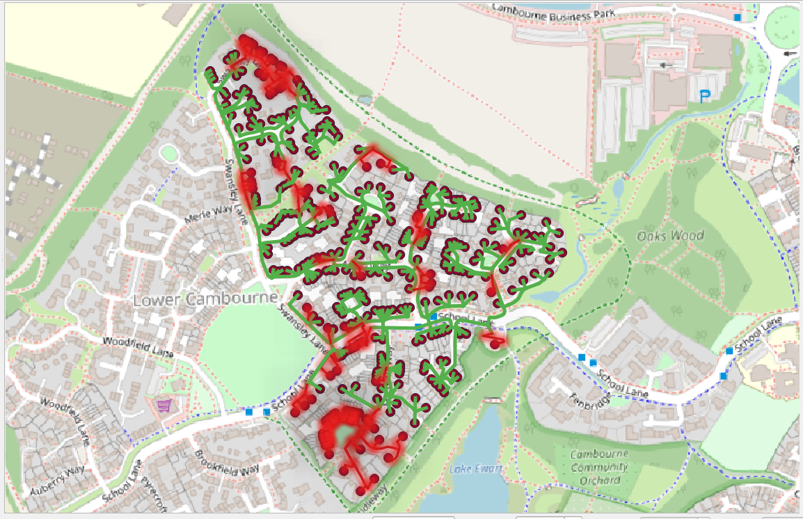

#  Rapport : Analyse des fichiers Shapefile

##  Qu’est-ce qu’un Shapefile ?

Un **Shapefile** est un format de fichier **géospatial** développé par **ESRI** pour stocker des données vectorielles (points, lignes, polygones) et leurs attributs.  
Il est largement utilisé dans les **Systèmes d’Information Géographique (SIG)** comme **QGIS** ou **ArcGIS**.

---

##  À quoi ça sert ?

- **Représenter des objets géographiques** : bâtiments, routes, réseaux électriques, etc.
- **Associer des attributs** : nom, type, surface, coût, etc.
- **Permettre l’analyse spatiale** : calcul de distances, intersections, zonages, planification.

---

##  Structure d’un Shapefile

Un Shapefile **n’est pas un seul fichier**, mais un **ensemble de fichiers** qui doivent rester dans le même dossier.  
Les **extensions principales** sont :

| **Extension** | **Rôle** |
|---------------|----------|
| `.shp`        | Contient la **géométrie** (points, lignes, polygones). |
| `.shx`        | Index des géométries pour un accès rapide. |
| `.dbf`        | Table attributaire (format dBase) : stocke les données descriptives (ex. nom, surface). |

**Extensions optionnelles :**

| **Extension** | **Rôle** |
|---------------|----------|
| `.prj`        | Définit le **système de coordonnées** (projection, ex. EPSG:4326). |
| `.cpg`        | Indique l’**encodage des caractères** (UTF-8, ISO-8859-1). |
| `.qix`        | Index spatial pour accélérer les requêtes. |

---

###  Exemple dans le projet :

- **batiments.shp** → géométrie des bâtiments.
- **batiments.dbf** → attributs (nom, surface, etc.).
- **batiments.prj** → projection utilisée.
- **batiments.shx** → index géométrique.
- **batiments.cpg** → encodage des caractères.
- **batiments.qix** → index spatial (optionnel).

Même logique pour **infrastructures.shp**, etc.

---

##  Importation dans QGIS

1. Ouvrir QGIS.
2. Glisser le fichier **`.shp`** dans la carte (les autres fichiers doivent être dans le même dossier).
3. QGIS lit automatiquement **`.shx`**, **`.dbf`**, **`.prj`** pour reconstruire la couche.

##  Visuel dans QGIS :

  
L’image ci-dessus montre une carte dans QGIS avec deux couches :
- **a_remplacer** (en rouge) : infrastructures endommagées à remplacer.
- **infra_intacte** (en vert) : infrastructures encore fonctionnelles.

Ces couches proviennent de Shapefiles importés dans QGIS et stylisés pour faciliter la planification des travaux.  
Le fond de carte est issu **d’OpenStreetMap**, ce qui permet de situer les infrastructures dans leur contexte géographique.
Nous avons fusionné la couche Shapefile des infrastructures avec le classeur Excel **reseau_en_arbre**.
Cette opération permet d’enrichir la couche géographique avec des informations supplémentaires provenant du fichier tabulaire.

### Jointure attributaire dans QGIS
La fusion s’effectue via une jointure attributaire dans QGIS :

- Accès :Propriétés de la couche → Jointures → Ajouter une jointure.

- Clé de jointure :Un identifiant commun entre les deux sources (exemple : id_infra).

Cette étape relie chaque entité géographique à ses attributs correspondants dans le fichier Excel.

---

##  Références

- [ESRI Shapefile Technical Description](https://www.esri.pdf  
- [Documentation QGIS – Formats supportés](https://docs.qgis.org/latest/fr/docs/user_manual/managing_data_source/openingector/shapefile.html  

---

